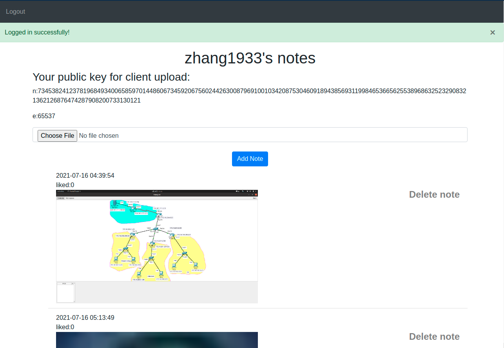

# 数字内容安全小学期实践 实验报告
## github项目地址：[数字内容安全小学期实践](https://github.com/Zhang1933/digital-content-security)

## 小组成员
* 张华睿 2019302120113
* 曲乐然 2019302120094
* 李洲阳 2019302120086
## 任务目标：
- [x] 平台搭建,图片上传、图片下载、用户登陆,管理所上传的图片、点赞功能
- [x] 利用客户端批量上传图片。
- [x] 在客户端批量上传图片时对图片嵌入隐私信息。
- [x] 当所嵌入信息过多时，对信息的分片处理。
- [x] 爬虫，爬取图片，分辨嵌有隐私信息的图片，对所嵌入的信息进行提取、组合。
## 实验环境：
* Ubuntu 20.04.2 LTS
## 网站搭建
利用python flask库 搭建网站。
### 如何运行：
进入web文件,进入pipenv虚拟环境之后：
```
python main.py
```
### 搭建结果：
#### 主页：

<center style="font-size:14px;color:#fffff;text-decoration:underline">网站主页</center>
#### 用户注册之后登陆：
* 点击导航栏中的Sign Up 注册。
* 注册后，服务器会在数据库中添加用户信息。注册之后就可以登陆了。
* 注册密码需要大于3位数。
* 邮箱不能重复,邮箱需要有效格式。
#### 登陆并上传图片结果：
图片将会保存在服务器上，数据库中存的是图片在服务器中的路径字符串而不直接是图片,读取的时候读取链接路径。


<center style="font-size:14px;color:#fffff;text-decoration:underline">登陆之后每个用户可以管理自己的上传</center>
* 登陆之后，可以删除或添加图片.
#### 为用户生成公私钥：
* 每个用户在注册之后，服务器自动帮用户生成一个公私钥对，用来加密后面批量上传中upload_helper 客户端中用户所需要传给服务器的密码隐私信息。
* 这里用的时RSA算法，自动为用户生成n，e。
* 用户登陆之后，查看自己的公钥,用来客户端批量上传图片。
#### 用户登出之后，在主页就可以看到所有用户共享的Note。

<center style="font-size:14px;color:#fffff;text-decoration:underline">不同用户上传的图片</center>
* 可以对喜欢的图片点赞。
* 但主页上图片数量超过5张时，那么第6张的展示将会展示到下一页。当存在下一页时，自动出现`next page` 按钮翻页。
* 按照上传时间，逆序展示所有用户上传的图片。
* uploader 就是上传者的用户名。
## 利用被植入了后门的木马客户端
### 安装虚拟环境之后，查看脚本帮助信息,执行：
```
python upload_helper.py -h
```
* eg:输入的url格式为`http://192.168.43.137:5000/` 路径格式为`./img`
* 会对tiff，bmp，png图片格式进行嵌入。采用LSB 隐写。
#### 用被植入了后门的客户端的上传结果:

这里用了两张小容量图片来展示,由于单张图片不足以嵌完信息,用户目录信息被分片嵌入到这两张图片.这里测试只用了两张图片，实际可以嵌入更多图片直到所有信息嵌入完。

* 客户端上传是用python生成一个json的post请求发送给服务器。json中有用户的邮箱，所上传的图片，以及用RSA用户公钥加密之后的用户密码等信息。图片转成二进制序列之后用base64编码放到json中，发给服务服务器。
* 服务器根据所接收到的json,取出用户的邮箱、加密后的密码，然后用用户私钥解密所发来的密码，与数据库中所存的密码进行比对验证。
##### 一些不足:
* 不能防止重放攻击。
* 所上传的图片没有加密,hacker可以掉包。
* 虽然在客户端与服务器交互的时候用户密码信息被保护，但在网页端交互的时候，由于用的是http协议，在提交表单给服务器的时候仍然会暴露用户密码信息。

## 爬取图片,提取图片中所嵌入的隐私信息,并将分片组合。
* 进入crawler子目录:
* 启动虚拟环境之后，执行：
```
python get_message.py
```
* 输入所要爬取的url,eg:`http://192.168.43.137:5000/`。然后爬取的图片会自动保存在当前img 目录。如果没有该文件，需要先自己手动创建。
* 执行完成之后，会将提取到的信息进行重新组合写入当前目录下data.txt文件。
* 生成结果：

* 文件最后，会写出同一类码（kind ）,表示以上信息是来自同一个同一类码的信息,在信息被分片之后后，每个分片会有一个相同的同一类码，表示这是一组。
### 分片组合算法
#### 分片过程
参考ip数据报分组流程,图片嵌入秘密信息之后，会在图片前56 lsb 比特位嵌入header字段。
##### header首部的构成：

###### 标志字段：
对于嵌入了信息的图片，图片的前lsb8位会被更改为一个固定的序列,来标识图片中含有数据信息。简单的所就是识别含有数据信息特征的图片。
###### 长度字段
对于嵌入了秘密信息的图片，表示数据信息bit的长度。
###### 序号
用于将提取到的含密信息的排序，重组被分片的信息。
###### 同一类码
信息被分片后，来自于同一被分片信息的图片同一类码相同，反之不同，为了将图片归类提取信息。
###### 数据字段
所嵌入的密码信息。
##### 木马程序嵌入过程 
* 程序在获取到用户信息后，会贪婪的尝试将图片嵌入到所需要上传的图片当中,直到把信息嵌完.
嵌入原则：贪心原则。读取图片lsb最多可以嵌入多少位，如果图片的容量小于首部的比特长度(56bit)，则跳过这张图片。否则，贪心的将信息嵌入到这张图片当中。当信息没嵌完时，下一张图片继续嵌入.直到信息全部完毕或者没有图片可以嵌入。
##### 木马客户端上传流程图：

##### hacker 提取信息过程：
* 将网站上所有图片爬取下来之后。根据嵌入了秘密信息图片中含有的首部标志字段，筛选出含有秘密信息的图片。然后根据同一类码，将含密图片归类，根据序号，将同一类的图片进行排序，最后根据首部中的长度字段依次提取秘密信息。
##### hacker 得到隐私信息流程图：

## 参考链接
* [Upload Image using POST form data in Python-requests](https://stackoverflow.com/questions/29104107/upload-image-using-post-form-data-in-python-requests)
* [getbootstrap](https://getbootstrap.com/docs/4.4/content/images/)
* [Flask-SQLAlchemy](https://flask-sqlalchemy.palletsprojects.com/en/2.x/#requirements)
* [Python Website Full Tutorial - Flask, Authentication, Databases & More](https://www.youtube.com/watch?v=dam0GPOAvVI&t=611s)
* [python-rsa-文档](https://stuvel.eu/python-rsa-doc/usage.html)
* [Flask用paginate实现数据分页](https://www.jianshu.com/p/a68d4e6a20d1)
* [Browser: Prevent POST data resubmit on refresh using only JavaScript](https://stackoverflow.com/questions/45656405/browser-prevent-post-data-resubmit-on-refresh-using-only-javascript)
* [flask Uploading Files](https://flask.palletsprojects.com/en/2.0.x/patterns/fileuploads/)
## 小组成员分工：
* 网站搭建：张华睿
* 木马客户端制作:张华睿
* 嵌入、提取信息工具制作：曲乐然
* 分片算法设计：曲乐然，张华睿
* 爬虫工具制作：李洲阳
* hakcer 使用的get_message 程序制作：张华睿
* 报告撰写：张华睿、李洲阳
